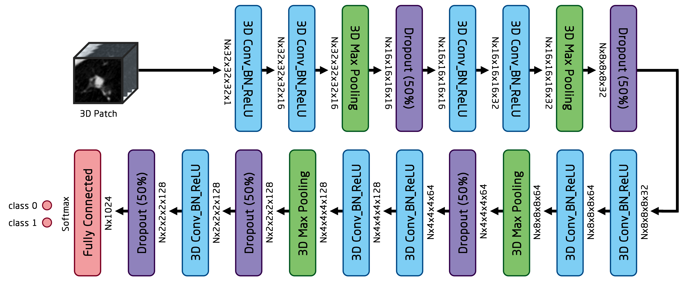

# Surrogate Supervision for Nodule Detection FPR

## Data

### 1. FPR:
The task of FPR for nodule detection is to label each nodule candidate (3D patch) as either nodule or non-nodule.
733, 95, and 190 CT series (190 CT series, why?) from LIDC dataset [1] were used for training, validation, and testing respectively.
A 3D faster RCNN model is then used to generate 3D candidates extracted from all these 1,018 CT series.
These candidates are then combined with the false positive and ground truth 3D patches provided by LUNA16 challenge [2] to serve as training, validation, and testing data for FPR model.
Finally, there are 784,241 3D patches used for training, 4,750 used for validation, and 3,059 used for testing.

For preprocessing, all 3D patches are clipped from -1200 to 600 in Hounsfield unit.
Their values are then normalized into the range of -1 to 1.
All 3D patches are resampled to the spacing of 1mm x 1mm x 1mm.
Finally they are center cropped to the shape of 32 x 32 x 32 along z, y, and x axis.

To alleviate the class imbalace problem, the ratio between non-nodule patches and nodule patches are kept to 8:1 when feeding the data to the FPR model during training.
To every nodule 3D patch, we upsample it by using the following rule: (1) if the diameter of the nodule is smaller than 3mm, we abandon it;
(2) if the nodule diameter is between 3mm and 25mm, we upsample it by 2 times;
(3) if the nodule diameter is between 25mm and 50mm, we directly feed it into the model without upsampling.

### 2. GAN:
For surrogate supervision task, the GAN model is trained using both the 784,241 FPR training patches and the 4,750 FPR validation patches. It is then tested on the 3,059 FPR testing patches.
The preprocessing and upsampling follows the same methods adopted by FPR model.

## Architectures

### 1. FPR:

### 2. GAN:

This GAN model follows the same training and inference procedures as proposed in the original GAN paper [3].

## Training Details
Both FPR and GAN were implemented using Tensorflow [4].
They were both trained on an NVIDIA 1080Ti GPU.

### 1. FPR:
Batch size is 128. Total number of training iterations is 196,000.
An SGD optimizer was used for configuring the learning rate.
The learning rate started at 3e-4, then decreased by 10 times at training step of 120,000.

The model was trained from scratch, pretrained from the discriminator of the surrogate supervision GAN model using 10%, 25%, 50%, and 100% of all the 784,241 3D training patches. There has been altogether 8 FPR models been trained.

### 2. GAN:
Batch size is 64. Total number of training iterations is 96,000.
Wasserstein loss [6] was selected because of its stability.
The dimension of the latent variables is 100.
An Adam optimizer was used for configuring the learning rate with beta1 of 0.5 and beta2 of 0.99.
The learning rate started at 2e-4. 

Most importantly, the training was conducted in a progressive fashion as suggested by [5] to generate higher quality 3D patches.
Notice there are 4 alphas in both the discriminator and generator network as shown in the figure above.
These alphas were used to configure the training phase of the entire GAN model by controlling the input 3D patch and output fake 3D patch resolution.
Specifically, when alpha1 is turned on, the resolution is 4x4x4;
when alpha2 is turned on, the resolution is 8x8x8;
when alpha3 is turned on, the resolution is 16x16x16;
when alpha4 is turned on, the resolution is 32x32x32;
The slope for gradually turning on these alphas is 0.002.
After 5,000 training steps, alpha1 was turned on;
after 12,000 training steps, alpha2 was turned on;
after 19,000 training steps, alpha3 was turned on;
and after 26,000 training steps, alpha4 was turned on.

## Results

The performances of FPR models trained from scratch and pretrained from the discriminator of the surrogate supervision GAN model are shown above.
These performances are measured in terms of FROC AuC (up to different false positives) and CPM scores.
The x axis is the percentage of training data used for FPR model.

## References

[1]: Armato III, Samuel G., et al. "The lung image database consortium (LIDC) and image database resource initiative (IDRI): a completed reference database of lung nodules on CT scans." Medical physics 38.2 (2011): 915-931.

[2]: Arnaud Arindra Adiyoso Setio, et al. "Validation, comparison, and combination of algorithms for automatic detection of pulmonary nodules in computed tomography images: the LUNA16 challenge" CoRR, vol. abs/1612.08012, 2016.

[3]: I. J. Goodfellow, et al. "Generative adversarial nets" In Proceedings of NIPS, pages 2672–2680, 2014.

[4]: Abadi, Martín, et al. "Tensorflow: a system for large-scale machine learning." OSDI. Vol. 16. 2016.

[5]: Tero Karras, et al. “Progressive growing of gans for improved quality, stability, and variation,” CoRR, vol. abs/1710.10196, 2017.

[6]: Martin Arjovsky, et al. “Wasserstein gan,” arXiv preprint arXiv:1701.07875, 2017.

